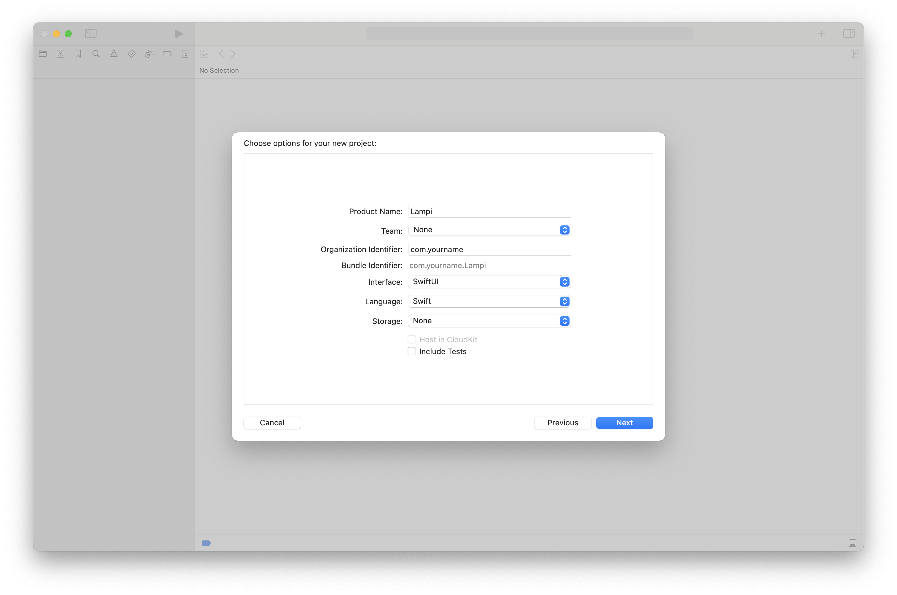
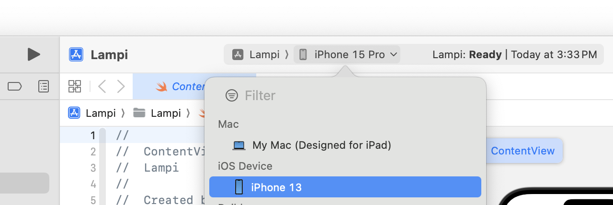

# iOS New Project

Now we are going to build a simple app and deploy it to our iOS device. The assignment will require running on real hardware, so as you run through this make sure you can deploy to a iPhone and not just the iPhone Simulator.

### Start a New Project

From the welcome page of Xcode, click **Create a new Xcode project** (or in the menu, **File** > **New** > **Project...**).

Under **iOS** > **Application**, select **App** and click **Next**.

In the next dialog, set:

* **Project Name** to **Lampi**
* **Team** to your name
* **Organization Identifier** to something like **com.[your_name]**
* **Interface** to **SwiftUI** 
* **Language** to **Swift** 
* **Storage** to **None**
* **deselect Include Tests** (unless you want to use tests, they are not part of this exercise)

**This Courseware is for Swift and SwiftUI. If you are more familiar with Objective C or the other iOS UI technologies and prefer to use it, that is fine, but you are on your own.**

Click **Next**. You will be asked where you want your project to be created. Choose a directory and click **Create** (deselect "Create Git Repository on my Mac").

### Build and Run on an iOS Device

Now is a good time to verify that we can run our project on a real phone - the app does not do anything at this point - it will only get more complicated from here. 

Plug in your iPhone to your Mac and unlock your phone if it is protected with a passcode. Up in the Xcode toolbar you should see your **build target** and **device**:

Xcode will likely have defaulted to building your the iPhone Simulator. Click on it, and under the **iOS Device** section, choose the iPhone you just plugged in:

Click the **Build and run** (play) button (or press ⌘ + R).

> **NOTE:** You need to follow the instructions to [Enable Developer Mode](https://developer.apple.com/documentation/xcode/enabling-developer-mode-on-a-device) on the iOS Device.  You can disable Developer Mode when you have completed Chapters 08 and 09.

You may be asked to enabled **Developer Mode** on the Mac. Click **Enable** and enter your OS password.

If this is your first time connecting your phone to Xcode, you may need to wait a while for "Processing Symbol Files".

If you get any prompts about Xcode failing to build and/or run and there is a button that says **Fix Issue** -  clicking this button should allow you proceed.

If you do experience any issues, go back to Xcode and click **Build and run** again. It should deploy and launch an app with **just a big white screen with "Hello, world! and a globe"** on your phone.

Congratulations! You have successfully built and deployed an app to an iOS device (the app does not do anything, yet, but we will work on that now).

Next up: [Making a SwiftUI App](../08.3_Making_a_SwiftUI_App/README.md)

&copy; 2015-2024 LeanDog, Inc. and Nick Barendt
