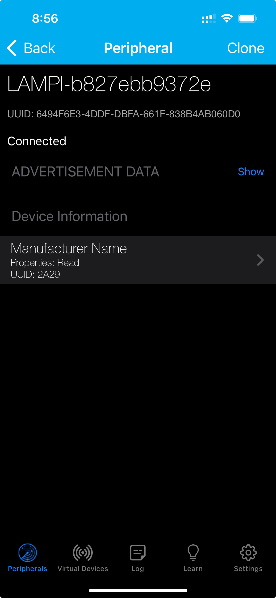
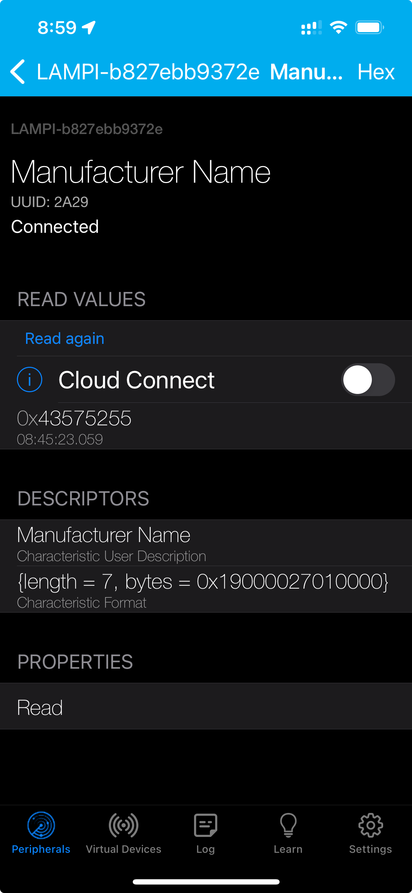

# Building a Simple BTLE GATT Service

We will now build up a simple BTLE GATT Service to illustrate how GATT Services and Characteristics work.  (Reminder, "GATT" stands for Generic Attributes, or how Centrals can interact with a Peripheral's Attributes in a general-purpose manner).

## A Simple Device Info Service

The BTLE specifications define some standard [GATT Services](https://www.bluetooth.com/specifications/gatt/services).  In addition, manufacturers are free to develop their own proprietary Services.

BTLE uses UUIDs extensively.  UUIDs are ["Universally Unique Identifiers"](https://en.wikipedia.org/wiki/Universally_unique_identifier).  They are 128-bits long and are practically unique in time and space if generated according to prescribed algorithms.

One of the defined GATT Services (see the [Assigned Numbers Document](https://www.bluetooth.com/specifications/gatt/services/)) is the `Device Information Service` (see the full descripion of the [Device Information Service](https://www.bluetooth.com/specifications/specs/device-information-service-1-1/).  

The Device Information Service provides a standard way to share basic device information, such as manufacturer name, model, serial number, etc.


The Device Information Service has an "Assigned Number" (UUID) of `0x180A`.  This is a 16-bit UUID.  16-bit UUIDs (and the less-common 32-bit UUIDs) are used to reduce BTLE payload sizes down from 128-bit for frequently used values.  Only the Bluetooth SIG can define UUIDs shorter than 128-bits.

In reality, all UUIDs are 128-bit UUIDs, but the Bluetooth SIG defines a base UUID of `00000000-0000-1000-8000-00805F9B34FB` and draws additional UUIDs from this by replacing the first eight hex digits `XXXXXXXX-0000-1000-8000-00805F9B34FB`, so 16-bit and 32-bit UUIDs are really 128-bit UUIDs based on this, replacing the `X` with the shorter UUID (left padding with zeros for the 16-bit UUIDs).  So, the `0x180A` UUID is really `0000180A-0000-1000-8000-00805F9B34FB`.


### Creating and Advertising a GATT Service.

We will incrementaly build up support for the Device Information Service.

Creat a new file **ble_demo.py**:

```python3
#! /usr/bin/env python3
from pybleno import Bleno
from device_info_service import DeviceInfoService
import time


class DemoBLEPeripheral():
    def __init__(self):
        self.bleno = Bleno()
        self.info_service = DeviceInfoService('CWRU', 'LAMPI', '123456')

        self.bleno.on('stateChange', self.onStateChange)
        self.bleno.on('advertisingStart', self.onAdvertisingStart)

    def start(self):
        self.bleno.start()

    def stop(self):
        self.bleno.stopAdvertising()
        self.bleno.disconnect()

    def onStateChange(self, state):
        print('on -> stateChange: ' + state)

        if (state == 'poweredOn'):
            self.bleno.startAdvertising('Lampi-Test',
                                        [
                                            self.info_service.uuid,]
                                        )
        else:
            self.bleno.stopAdvertising()

    def onAdvertisingStart(self, error):
        print('on -> advertisingStart: '
              + ('error ' + error if error else 'success'))

        if not error:
            self.bleno.setServices([
                self.info_service,
            ])

def main():

    ble_peripheral = DemoBLEPeripheral()
    ble_peripheral.start()

    while not stopflag:
        time.sleep(1)

    print("\nStopping BLE peripheral\n")
    ble_peripheral.stop()


if __name__ == "__main__":
    main()


```

You will see that we are requiring a new file **device_info_service.py**.  The `__init__` constructs a instance of the service, passing in a Manufacturer Name (`'CWRU'`), a Model Name (`'LAMPI'`) and a Serial Number (`'123456'`) as variables. We will create that file shortly.

Just as in our iBeacon example, we register hanlders for two  events:  `'stateChange'` and `'advertisingStart'`.  In our handler for `'stateChange'` we are calling `'startAdvertising()'` passing in a friendly service name ('Lampi-Test') a list of Service UUIDs to advertise (with only one element in the list).

Unlike in our handler example for the iBeacon, our handler for `'advertisingStart'`, calls `setServices()` with our list of Service Objects.  This makes the services available, allowing BTLE Centrals to connect to the services and interact with their Characteristics.

Create a new file `device_info_service.py` in the same directory:

```python3
from pybleno import BlenoPrimaryService, Characteristic, Descriptor
import struct

class DeviceInfoService(BlenoPrimaryService):
    uuid = '180a'

    def __init__(self, manufacturer, model, serial):
        BlenoPrimaryService.__init__(self, {
            'uuid': self.uuid,
            'characteristics': [
            ]
        })


``` 


We are defining a constructor function for `DeviceInfoService` which takes three parameters (manufacturer, model, and serial). 

While we have not provided any Characteristics, you can run this (after making `ble_demo.py` executable):

```bash
./ble_demo.py
```

If you use `LightBlue` you should see your Device show up - you can connect to it and see what information `LightBlue` is able to discover (press the `Show` to expand the `ADVERTISEMENT DATA`:


You can see the device is Connectable, the the device's Local Name is "Lampi-Test" and it is advertising the "Device Information" Service, but there is no information within the Device Information Service.  Let's fix that.

Modify `device_info_service.py` to add a Characteristic, like so:

```python3
from pybleno import BlenoPrimaryService, Characteristic, Descriptor
import struct


class ManufacturerCharacteristic(Characteristic):
    def __init__(self, manufacturer):
        Characteristic.__init__(self, {
            'uuid': '2A29',
            'properties': ['read'],
            'value': bytes(manufacturer, 'utf-8'),
            'descriptors': [
                Descriptor({
                    'uuid': '2901',
                    'value': bytes('Manufacturer Name', 'utf-8')
                }),
                Descriptor({
                    'uuid': '2904',
                    # Presentation Format fields are:
                    # Format      1 octet :  0x19 - utf8 string
                    # Exponent    1 octet :  0x00
                    # Unit        2 octets:  0x2700 - unitless
                    # Name Space  1 octet :  0x01 - Bluetooth SIG
                    # Description 2 octets:  0x0000 - blank
                    'value': struct.pack("<BBHBH", 0x19, 0x00,
                                         0x2700, 0x01, 0x0000)
                })
            ]
        })
        
class DeviceInfoService(BlenoPrimaryService):
    uuid = '180a'

    def __init__(self, manufacturer, model, serial):
        BlenoPrimaryService.__init__(self, {
            'uuid': self.uuid,
            'characteristics': [
                ManufacturerCharacteristic(manufacturer),
            ]
        })
```

### BLE GATT Characteristics

We have created a new class `ManufacturerCharacteristic` that inherits from the `Characteristic` base class.  Let's review BLE Characteristics.

BLE GATT Services have Characteristics.  Characteristics are the various _attributes_ of the Service.  Along with a value for each Attribute (a string, a number, etc.), Characteristics also have other metadata, including:

* a UUID (a 16-bit UUID if the Characteristic is defined by the Bluetooth SIG)
* properties (which define if the Characteristic can be read, written, or a few other capabiltities)
* Descriptors - additional information about the Characteristic

You can find the list of Bluetooth SIG Defined Characteristics in the [GATT Specification Supplement](https://www.bluetooth.com/specifications/gatt/characteristics/)

In our case, **Manufacturer Name String** [Device Information Service](https://www.bluetooth.com/specifications/specs/device-information-service-1-1/) and has a UUID of `0x2A29` and is a UTF-8 string (see the [Assigned Numbers Document](https://www.bluetooth.com/specifications/assigned-numbers/) and search for `0x2a29`).  Further, the [Device Information Service](https://www.bluetooth.com/specifications/specs/device-information-service-1-1/) defines the **Manufacturer Name String** property to be `Read` only.

We have added two Descriptors to the Characteristic.  Descriptors provide additional information about the Characteristic.  Descriptors have:

* a UUID (unsurprisingly)
* a value

See the **Assigned Numbers Document** and **GATT Specification Supplement** at [Assigned Numbers](https://www.bluetooth.com/specifications/assigned-numbers/).  

The two Descriptors we have added are:

* **Characteristic User Description** with a UUID of `0x2901`; this Descriptor is used to provide a short textual description of the Characteristic for users - we have provided a value of 'Manufacturer Name'
* **Characteristic Presentation Format** with a UUID of `0x2904`; this Descriptor is used to provide additional information about presenting the Characteristic value; the Descriptor value is a Python `bytes` type that indicates that the Characteristic Value is a UTF-8 string (see section 2.4 of the the [Assigned Numbers](https://www.bluetooth.com/specifications/assigned-numbers/) document to understand what the seven byte values mean).  See the Python [struct.pack](https://docs.python.org/3.7/library/struct.html?highlight=struct%20unpack#struct.pack) for more information, including the **Format Strings**.  


To recap:

* GATT Services have:
    * a UUID
    * zero or more Characteristics, each of which have:
        * a UUID
        * properties ('read', 'write', etc.)
        * a value ('CWRU' or 3.14159)
        * zero or more Descriptors which have:
            * a UUID
            * a value

BLE Centrals (clients) can traverse the Service/Characteristic/Descriptor data as they discover it by interogating the Server, and then interact with the Characteristics (reading them, modifying them, etc.), using the Descriptors to provide additional information about the Characteristics.


### Testing our Device Information Service         

Run the app:

```bash
./ble_demo.py
```

and use LightBlue to discover and connect to it.

You should see the Device Information Service, like we had earlier, with the 'Manufacturer Name' Characteristic



If you drill down into the 'Manufacturer Name' Characteristic 



you will see the value of `0x43575255` ('CWRU') and you can use the 'Read again' to read the value again (since there is no way for that value to change you will always see the same result).  You will also see the two Descriptors we defined with their values.  

We can add two more Characteristics to round out our Device Information Service with **Model Number String** and **Serial Number String** (see the Assigned Numbers Document and the GATT Specification Supplement [here](https://www.bluetooth.com/specifications/assigned-numbers/)for more information).

```python3
from pybleno import BlenoPrimaryService, Characteristic, Descriptor
import struct


class ManufacturerCharacteristic(Characteristic):
    def __init__(self, manufacturer):
        Characteristic.__init__(self, {
            'uuid': '2A29',
            'properties': ['read'],
            'value': bytes(manufacturer, 'utf-8'),
            'descriptors': [
                Descriptor({
                    'uuid': '2901',
                    'value': bytes('Manufacturer Name', 'utf-8')
                }),
                Descriptor({
                    'uuid': '2904',
                    # Presentation Format fields are:
                    # Format      1 octet :  0x19 - utf8 string
                    # Exponent    1 octet :  0x00
                    # Unit        2 octets:  0x2700 - unitless
                    # Name Space  1 octet :  0x01 - Bluetooth SIG
                    # Description 2 octets:  0x0000 - blank
                    'value': struct.pack("<BBHBH", 0x19, 0x00,
                                         0x2700, 0x01, 0x0000)
                })
            ]
        })


class ModelCharacteristic(Characteristic):
    def __init__(self, model):
        Characteristic.__init__(self, {
            'uuid': '2A24',
            'properties': ['read'],
            'value': bytes(model, 'utf-8'),
            'descriptors': [
                Descriptor({
                    'uuid': '2901',
                    'value': bytes('Model Number', 'utf-8')
                }),
                Descriptor({
                    'uuid': '2904',
                    # Presentation Format fields are:
                    # Format      1 octet :  0x19 - utf8 string
                    # Exponent    1 octet :  0x00
                    # Unit        2 octets:  0x2700 - unitless
                    # Name Space  1 octet :  0x01 - Bluetooth SIG
                    # Description 2 octets:  0x0000 - blank
                    'value': struct.pack("<BBHBH", 0x19, 0x00,
                                         0x2700, 0x01, 0x0000)
                })
            ]
        })

class SerialCharacteristic(Characteristic):
    def __init__(self, serial):
        Characteristic.__init__(self, {
            'uuid': '2A25',
            'properties': ['read'],
            'value': bytes(serial, 'utf-8'),
            'descriptors': [
                Descriptor({
                    'uuid': '2901',
                    'value': bytes('Serial Number', 'utf-8')
                }),
                Descriptor({
                    'uuid': '2904',
                    # Presentation Format fields are:
                    # Format      1 octet :  0x19 - utf8 string
                    # Exponent    1 octet :  0x00
                    # Unit        2 octets:  0x2700 - unitless
                    # Name Space  1 octet :  0x01 - Bluetooth SIG
                    # Description 2 octets:  0x0000 - blank
                    'value': struct.pack("<BBHBH", 0x19, 0x00,
                                         0x2700, 0x01, 0x0000)
                })
            ]
        })


class DeviceInfoService(BlenoPrimaryService):
    uuid = '180a'

    def __init__(self, manufacturer, model, serial):
        BlenoPrimaryService.__init__(self, {
            'uuid': self.uuid,
            'characteristics': [
                ManufacturerCharacteristic(manufacturer),
                ModelCharacteristic(model),
                SerialCharacteristic(serial)
            ]
        })        
```

Running this should result in three Characteristics showing up:


Congratulations - you have written your first, simple BLE GATT Service!

Next up: [09.3 Supporting Read and  Write on GATT Characteristics](../09.3_Supporting_Read_and_Write_on_GATT_Characteristics/README.md)

&copy; 2015-2024 LeanDog, Inc. and Nick Barendt
