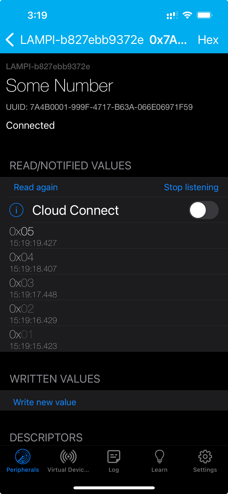
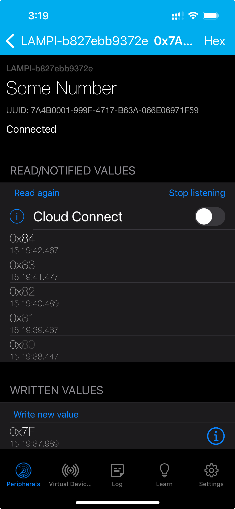

# MQTT Integration

To complete our BLE demonstration Peripheral, we need to add MQTT Integration.

We can do this by expanding the capabilities of the `NumberState` class.

## Adding MQTT Integration to `NumberState`

Modify `number_state.py` like so:

```python3
from paho.mqtt.client import Client
from collections import defaultdict
from typing import Callable, Optional
import json

# MQTT constants
MQTT_CLIENT_ID = "bemo_bt"
MQTT_BROKER_HOST = "localhost"
MQTT_BROKER_PORT = 1883
MQTT_BROKER_KEEP_ALIVE_SECS = 60
TOPIC_NUMBER_NOTIFICATION = 'number/changed'
TOPIC_NUMBER_SET = 'number/set'


class NumberState():
    def __init__(self):
        self._number = 0

        self.callbacks: Dict[str, List[Callable]] = defaultdict(list)

        self._setup_mqtt()

    def _setup_mqtt(self):
        self.mqtt = Client(client_id=MQTT_CLIENT_ID)
        self.mqtt.on_connect = self._on_mqtt_connect
        self.mqtt.connect(MQTT_BROKER_HOST, port=MQTT_BROKER_PORT,
                          keepalive=MQTT_BROKER_KEEP_ALIVE_SECS)
        self.mqtt.loop_start()

    def _on_mqtt_connect(self, client, userdata, flags, rc):
        self.mqtt.message_callback_add(TOPIC_NUMBER_NOTIFICATION,
                                       self._receive_new_number_state)
        self.mqtt.subscribe(TOPIC_NUMBER_NOTIFICATION, qos=1)

    def _receive_new_number_state(self, client, userdata, message):
        new_state = json.loads(message.payload.decode('utf-8'))

        print(f"Got new state: {new_state}")

        if new_state.get('number', 0) != self._number:
            self._number = new_state.get('number', 0)
            self.emit('numberChange', self.number)

    # event handler registration
    def on(self, event: str, func: Optional[Callable] = None):
        def subscribe(func: Callable):
            if not callable(func):
                raise ValueError("Argument func must be callable.")
            self.callbacks[event].append(func)
            return func
        if func is None:
            return subscribe
        subscribe(func)

    # generate (emit) events
    def emit(self, event, message):
        for callback in self.callbacks[event]:
            callback(message)

    @property
    def number(self):
        return self._number

    @number.setter
    def number(self, new_value):
        if new_value != self._number:
            if new_value >= 0xff:
                new_value = 0
            self._number = new_value
            self._publish_state_change()

    def _publish_state_change(self):
        msg = {'number': self._number}
        self.mqtt.publish(TOPIC_NUMBER_SET,
                          json.dumps(msg).encode('utf-8'), qos=1)
```

We have added some MQTT integration, including:

* Two MQTT Topics:
	* TOPIC_NUMBER_NOTIFICATION = 'number/changed'
	* TOPIC_NUMBER_SET = 'number/set'
* A `_setup_mqtt()` method to create the Paho MQTT Client and configure it appropriately
* A `_on_mqtt_connect()` method to add a subscription and a callback method when messages are received
* The message received callback `_receive_new_number_state` that decodes the message, updates the internal state varaiable `_number` **and, critically** generates the `numberChange` with the `emit()` method
* Added the call to the new `_publish_state_change()` method to the _setter_ for the the `number` property

This code will update the `number` property to be updated whnever a new state is received in an MQTT message and cause the BLE Characteristic to be updated automatically if a Central has Notifications enabled.

It will also publish a new MQTT message whenever the BLE Characteristic is updated via a Write from a Central.

## MQTT Test Server

Here is a simple MQTT service to interact with - save it to **mqtt_number.py** and make it executable:

```python3
#! /usr/bin/env python3
from paho.mqtt.client import Client
import json
import time

MAX_NUMBER = 0xff

# MQTT constants
MQTT_CLIENT_ID = "demo_bt"
MQTT_BROKER_HOST = "localhost"
MQTT_BROKER_PORT = 1883
MQTT_BROKER_KEEP_ALIVE_SECS = 60
TOPIC_NUMBER_NOTIFICATION = 'number/changed'
TOPIC_NUMBER_SET = 'number/set'


class NumberMQTTService:

    def __init__(self):
        self._number = 0

        self._setup_mqtt()

    def _setup_mqtt(self):
        self.mqtt = Client(client_id=MQTT_CLIENT_ID)
        self.mqtt.on_connect = self._on_mqtt_connect
        self.mqtt.connect(MQTT_BROKER_HOST, port=MQTT_BROKER_PORT,
                          keepalive=MQTT_BROKER_KEEP_ALIVE_SECS)
        self.mqtt.loop_start()

    def _on_mqtt_connect(self, client, userdata, flags, rc):
        self.mqtt.message_callback_add(TOPIC_NUMBER_SET,
                                       self._receive_new_number_request)
        self.mqtt.subscribe(TOPIC_NUMBER_SET, qos=1)

    def _receive_new_number_request(self, client, userdata, message):
        new_state = json.loads(message.payload.decode('utf-8'))
        if new_state['number'] <= MAX_NUMBER:
            self._number = new_state['number']
        else:
            print(f"Received {new_state['number']} too large!")

    def _publish_number_state(self):
        msg = {'number': self._number}
        self.mqtt.publish(TOPIC_NUMBER_NOTIFICATION,
                          json.dumps(msg).encode('utf-8'), qos=1)

    @property
    def number(self):
        return self._number

    @number.setter
    def number(self, new_value):
        if new_value != self._number:
            if new_value >= 0xff:
                new_value = 0
            self._number = new_value
            # publish updated value
            self._publish_number_state()


def main():
    number_service = NumberMQTTService()

    while True:
        number_service.number = number_service.number + 1
        time.sleep(1)


if __name__ == "__main__":
    main()
```

This service will listen for updates on the `number/set` topic.  

It will publish a new message on `number/changed` whenever the value changes.

The `main()` method will update the value every second by adding 1 to the current value.

The value is constrained to be 0-255.

## Testing everything

Open three SSH sessions.

In the 1st run:

```bash
./ble_demo.py
```

In the 2nd run:

```bash
./mqtt_number.py
```

In the 3rd run:

```bash
mosquitto_sub -v -t number/#
```

In the 3rd, you should see output like:

```bash
number/changed {"number": 1}
number/changed {"number": 2}
number/changed {"number": 3}
number/changed {"number": 4}
number/changed {"number": 5}
number/changed {"number": 6}
number/changed {"number": 7}
```

If you connect via LightBlue and enable notifications on the `Some Number` Characteristic you should see new values appearing approximately every second, matching the values in the 3rd SSH session:



If you Write a new value with LightBlue should see that reflected in the 3rd Session as well as in the updated values appearing in LightBlue:




That completes the basic BLE / MQTT application.

Next up: [09.6 iOS Core Bluetooth](../09.6_iOS_Core_Bluetooth/README.md)

&copy; 2015-2024 LeanDog, Inc. and Nick Barendt